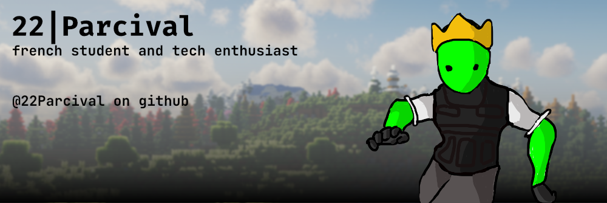

  

<h3 align="center">Salut ! Moi c'est 22Parcival 👋</h3>

  💻 Développeur passionné &amp; curieux de tech 
  🚀 Actuellement en train de contribuer sur <a href="https://github.com/SparksLyse-Community" target="_blank">SparksLyse-Community</a>

---

### 💻 Stack &amp; Compétences

**Je maîtrise :**

  

**J'apprends :**

  

---

### 📂 Mes Projets favoris

  

---

### 🌐 Retrouvez-moi

  
  <a href="https://instagram.com/22Parcival" target="_blank">
    
  <a href="https://discordapp.com/users/751472879421358182" target="_blank">
  

---

   
  <i>"pour faire du code ta juste besoin de quoi coder"</i>

